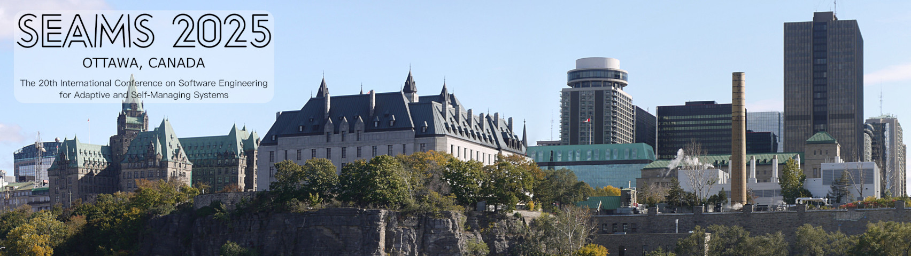

<section class="vcard" style="margin-top: 10px;">
    

      
      
Based on the <a href="https://commons.wikimedia.org/wiki/File:Ottawa_skyline_panorama1.jpg" target="_blank" rel="noopener">Ottawa skyline panorama</a> under <a href="https://creativecommons.org/licenses/by-sa/2.5/ca/deed.en" target="_blank" rel="noopener">CC BY-SA 2.5 CA</a>

    

</section>
[20th IEEE/ACM International Conference on Software Engineering for Adaptive and Self-Managing Systems (SEAMS 2025)](https://conf.researchr.org/home/seams-2025/){:target="_blank"}, co-located with [ICSE 2025](https://conf.researchr.org/home/icse-2025){:target="_blank"} in Ottawa, Canada.

<!--<iframe src="https://www.linkedin.com/embed/feed/update/urn:li:share:7323687565360881664" height="1126" width="504" frameborder="0" allowfullscreen="" title="Embedded post"></iframe> -->

<iframe src="https://www.linkedin.com/embed/feed/update/urn:li:share:7323687565360881664?collapsed=1" height="265" width="504" frameborder="0" allowfullscreen="" title="Embedded post"></iframe>

_Copy of the LinkedIn post below._

We had a fantastic SEAMS 2025 co-located with ICSE in Ottawa with a high-quality program comprising eleven long, six short, and two artifact papers, two outstanding keynotes by Jane Cleland-Huang and Bashar Nuseibeh, and a highly interactive panel on self-adaptive systems and AI. Throughout SEAMS 2025, we have seen lively discussions in all sessions.

Many thanks to all authors, attendees, and members of the program and organization committees for making SEAMS 2025 such a success.

As in previous years, we awarded distinguished papers with awards:

**Best Paper Award:**
Alessandro Palma, Houssam Hajj Hassan, Georgios Bouloukakis: SPARQ: A QoS-aware Framework for Mitigating Cyber Risk in Self-Protecting IoT Systems

**Best Student Paper Award:**
Xiaotong Ji, Hanchun Wang, Antonio Filieri, Ilenia Epifani: Robust Probabilistic Model Checking with Continuous Reward Domains

**10-Year Most Influential Paper Award:**
Antonio Filieri, Martina Maggio, Konstantinos Angelopoulos, Nicolas DIppolito, Ilias Gerostathopoulos, Andreas Hempel, Henry Hoffmann, Pooyan Jamshidi, Evangelia Kalyvianaki, Cristian Klein, Filip Krikava, Sasa Misailovic, Alessandro Vittorio Papadopoulos, Suprio Ray, Amir Molzam Sharioo, Stepan Shevtsov, Mateusz Ujma, Thomas Vogel: Software Engineering Meets Control Theory

Congratulations!

The Best Artifact Award has not been given this year. The proceedings are not available yet in the IEEE/ACM digital libraries. We will inform you when this happens.

SEAMS 2026 will be co-located with ICSE 2026 in Rio de Janeiro, Brazil (April 12-18, 2026). The general chair of SEAMS 2026 is Andrea Zisman, and the PC co-chairs are Amel Bennaceur and Eunsuk Kang.

See you at SEAMS 2026!

--
Siobhán Clarke, Shiva Nejati, Thomas Vogel 
