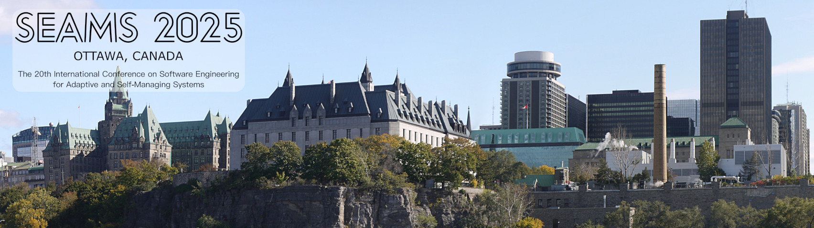

 &copy; <a href="http://sabine-mittermeier.de" target="_blank" style="color:gray;">Sabine Mittermeier</a>

<section class="vcard" style="padding-top:.25em">
  
      <i class="fa-solid fa-microscope" aria-hidden="true" title="Research"></i>
    
    Research: 
    
      &nbsp;&nbsp;Testing software and engineering autonomous systems
    
     
    
      <i class="fa-regular fa-building" aria-hidden="true" title="Affiliation"></i>
    
    Affiliation: 
    &nbsp;&nbsp;&nbsp;Humboldt-Universität zu Berlin (<a href="contact">mail/visitor address</a>)
     
    
      <i class="fa-regular fa-envelope" aria-hidden="true" title="E-mail"></i>
    
    E-mail:
    &nbsp;&nbsp;<a href="mailto:{{site.email}}">{{site.email}}</a>  
     
    
    <i class="fa-solid fa-phone" aria-hidden="true" title="Phone"></i>
    
    Phone: 
    &nbsp;&nbsp;+49 30 2093-41147 
     
     <!-- #0085ff -->
      <i class="fa-brands fa-bluesky" aria-hidden="true" title="Bluesky"></i>
    
    Bluesky: 
    &nbsp;&nbsp;<a rel="me" href="{{site.bluesky}}" target="_blank">{{site.bluesky_handle}}</a>
     
     <!-- rgb(99 100 255) -->
    <i class="fa-brands fa-mastodon" aria-hidden="true" title="Mastodon"></i>
    
    Mastodon: 
    &nbsp;&nbsp;<a rel="me" href="{{site.mastodon}}" target="_blank">{{site.mastodon_handle}}</a>
     
    
      <i class="fa-brands fa-linkedin" aria-hidden="true" title="LinkedIn"></i>
    
    LinkedIn: 
    &nbsp;&nbsp;<a rel="me" href="{{site.linkedin}}" target="_blank">{{site.linkedin_handle}}</a>
     
    
      <i class="fa-brands fa-github" aria-hidden="true" title="GitHub"></i>
    
    GitHub: 
    &nbsp;&nbsp;<a rel="me" href="{{site.github}}" target="_blank">{{site.github_handle}}</a>
      <!--   
          

         

        

        
 -->
</section>
<!--   -->
 

Thomas Vogel is a postdoctoral researcher in the [Software Engineering Group](https://www.informatik.hu-berlin.de/en/forschung-en/gebiete/se){:target="_blank"} at the [Humboldt-Universität zu Berlin](https://www.hu-berlin.de/en){:target="_blank"}. From 10/2021 to 09/2022, he was [stand-in professor for Empirical Software Engineering at Paderborn University](https://www.uni-paderborn.de/en/person/92621){:target="_blank"}. Previously, he was a doctoral student in the [System Analysis and Modeling Group](https://hpi.de/en/giese/){:target="_blank"} at the [Hasso Plattner Institute](https://hpi.de/en.html){:target="_blank"} at [University of Potsdam](https://www.uni-potsdam.de/en/index.html){:target="_blank"}, where he received his [Ph.D.](publications/phd) degree with summa cum laude in 2018.
He studied Information Systems and graduated with distinction from the [University of Bamberg](https://www.uni-bamberg.de/en/){:target="_blank"}.
His research interests are in the areas of (search-based and model-driven) software engineering, self-adaptive & intelligent/autonomous systems, and automated quality assurance of software as well as the combination of these areas.

## Calls

[**20th IEEE/ACM International Conference on Software Engineering for Adaptive and Self-Managing Systems (SEAMS 2025)**](https://conf.researchr.org/home/seams-2025/){:target="_blank"}, co-located with [ICSE 2025](https://conf.researchr.org/home/icse-2025){:target="_blank"} in Ottawa, Canada.
<section class="vcard" style="margin-top: 10px;">
    

      
      
Based on the <a href="https://commons.wikimedia.org/wiki/File:Ottawa_skyline_panorama1.jpg" target="_blank" rel="noopener">Ottawa skyline panorama</a> under <a href="https://creativecommons.org/licenses/by-sa/2.5/ca/deed.en" target="_blank" rel="noopener">CC BY-SA 2.5 CA</a>

    

</section>

 
[Past calls](pastcalls)

<!--
<section class="vcard" style="margin-top: 25px;">

<a href="pastcalls.html">Past Calls</a>

</section>
-->

## News

* __Oct 2024__ --- I was invited to the PC of the [_6th ACM/IEEE International Conference on Automation of Software Test (AST 2025)_](https://conf.researchr.org/home/ast-2025){:target="_blank"}. Consider submitting your work on test automation.
* __Sep 2024__ --- I was invited to the PC of the [_18th International Workshop on Search-Based and Fuzz Testing (SBFT 2025)_](https://sbft25.github.io/){:target="_blank"}. Consider submitting your work on fuzzing and testing.
* __Aug 2024__ --- Back to work from parental leave during which the following news arrived:
  * My project [_Controlling Search-Based Test Generation and Program Repair_](projects/flash2) was accepted for funding by the Deutsche Forschungsgemeinschaft (DFG, German Research Foundation).
  * I am the Program Committee Co-Chair of the Research Track at the [_20th ACM/IEEE International Conference on Software Engineering for Adaptive and Self-Managing Systems (SEAMS 2025)_](https://conf.researchr.org/home/seams-2025/){:target="_blank"}, together with Shiva Nejati.
  * Our article [_Explainability for Property Violations in Cyberphysical Systems: An Immune-Inspired Approach_](publications/2024-IEEESoftware) has been pulished in _IEEE Software_.
  * Our paper [_Formal Synthesis of Uncertainty Reduction Controllers_](publications/2024-SEAMS) has been accepted at the 19th ACM/IEEE International Conference on Software Engineering for Adaptive and Self-Managing Systems ([SEAMS 2024](https://conf.researchr.org/home/seams-2024){:target="_blank"}) and we won the __Best Paper Award__.

  
  * I was invited to the PC of the Research Papers Track of the [_18th IEEE International Conference on Software Testing, Verification and Validation (ICST 2025)_](https://conf.researchr.org/home/icst-2025){:target="_blank"}. Consider submitting high-quality testing, verification, or validation papers.
* __Jan 2024__ --- I am on parental leave from January to August 2024.

<!-- ## Past News -->
 
[Past news](pastnews)

<!--

    <ul>
        
        <li>
            {{ post.date | date: '%Y %b %d' }} - <a href="{{ post.url }}">{{ post.title }}</a>
        </li>
        
    </ul>

-->

## Communities

<section class="vcard" style="margin-left:35px;margin-top:25px;">

 
 

 

</section>
